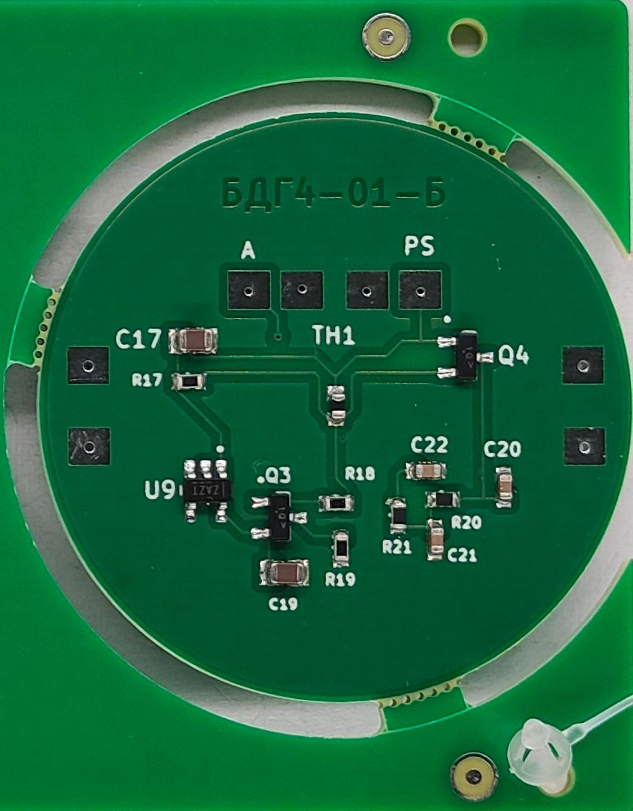
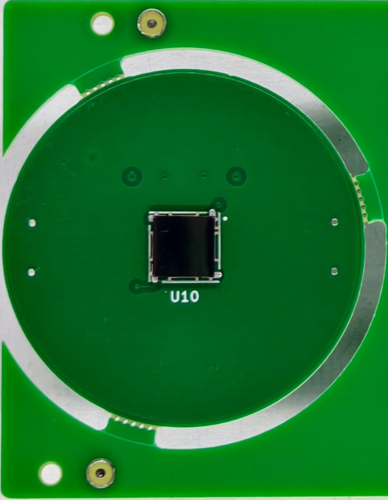

# OGK-SiPM-Board
🖸 OpenGammaKit PCB module designed for the 6 mm C-Series MicroFC-60035 SiPM in KiCad

## PCB front and back side

<table>
  <tr>
    <td align="center">
      
       <b>Front view</b>
    </td>
    <td align="center">
      
       <b>Back view</b>
    </td>
  </tr>
</table>

## Description

This carrier board is designed for the 6 mm C-Series MICROFC-60035-SMT silicon photomultiplier (SiPM) by [onsemi](https://www.onsemi.com/pdf/datasheet/microc-series-d.pdf). It was developed specifically for the [OpenGammaKit](https://github.com/vikulin/OpenGammaKit/) detector, but it can also be used in other systems. An optional circuitry for automatic SiPM temperature gain compensation is included.

On the **front side**, only the sensor is mounted, while all supporting components are placed on the **back side**. This layout provides optimal optical coupling and ensures light-tight sealing. The unused SiPM pin 4 is tied to the ground pad, adding thermal mass and connecting it to the ground plane, where the NTC is also located.

The PCB integrates the recommended SiPM biasing filter and optional temperature compensation. To enable them, solder all required components and connect wires to the **PS** and **GND** pads. The SiPM signal output is available at the **anode (A)** pad.

---

## Order the PCB or PCB + Assembly

You can order the **OGK SiPM Board** PCB or a fully assembled board directly from PCBWay using the link below:

👉 [Order PCB or PCB + Assembly from PCBWay](https://www.pcbway.com/project/shareproject/OpenGammaKit_SiPM_Board_a366bfd7.html)

This helps support the project and ensures high-quality manufacturing.

---

## 📷 3D render previews of the boards

   
  
   
  

---

## 📦 Release Contents

OGK-SiPM-Board releases include all the fabrication files required to manufacture and assemble the SiPM board for OpenGammaKit gamma-rays spectrometer:

| File Name                                     | Description                                                                |
| --------------------------------------------- | -------------------------------------------------------------------------- |
| `ogk-sipm-board-gerber-files-<version>.zip`   | 🟢 Complete Gerber and Drill files for PCB fabrication.                    |
| `ogk-sipm-board-centroid-file-<version>.csv`  | 📍 Centroid (Pick-and-Place) file in mils for automated assembly.          |
| `ogk-sipm-board-<version>.pdf`                | 📄 PDF documentation                                                       |
| `BOM.csv`                                     | 📋 Bill of Materials                                                       |

📁 **Location**: All files are available in the [Assets](https://github.com/vikulin/OGK-SiPM-Board/releases) release section.

---

## 🧠 Companion Projects

- **OpenGammaKit**  
  Open-source gamma-rays spectrometer hardware platform 
  👉 [OpenGammaKit Repository](https://github.com/vikulin/OpenGammaKit)

- **OGK Inspector (Android App)**  
  View spectra, calculate resolution, access terminal mode  
  👉 [OGK-Inspector on GitHub](https://github.com/vikulin/OGK-Inspector)

- **OGK Firmware**  
  USB serial interface firmware for supported microcontrollers  
  👉 [OGK Firmware Repository](https://github.com/vikulin/OGK-Firmware)

---
The temperature compensation design is based on the paper *[“Temperature-Compensated Silicon Photomultiplier”](https://doi.org/10.1016/j.nima.2017.11.060)* by Evgeny Kuznetsov. Most of the research and testing for this board was carried out by **@sebyon** — many thanks for the contribution!
